# GitHub 组织级标准化方案：一人公司的多 Agent 协作基础设施

> 日期：2026-02-23 | 适用场景：一人公司 / 多仓库管理 / AI Agent 协作

---

## 一、核心论点

> **"一人公司的核心是文件系统。给文件系统配上版本控制是第一步，给版本控制配上标准化流程控制，是让文件系统可以多"人"协作的关键。"**

GitHub 提供了一个被严重低估的基础设施 — **组织级 `.github` 仓库**。它允许你在一个中心仓库中定义规则，自动同步到组织下所有 repo。这让一人公司能用**组织级治理思维**管理数十甚至上百个项目。

---

## 二、分层架构

```
┌─────────────────────────────────────────────────────────────────┐
│                   Organization Rulesets（强制层）                 │
│  分支保护 · PR 审查要求 · 状态检查 · 签名验证 · 合并策略         │
│  ⚡ 代码级强制执行，Repo 管理员也无法绕过                        │
├─────────────────────────────────────────────────────────────────┤
│                   组织级 .github 仓库（宪法层）                   │
│  CI/CD 模板 · Agent 规则 · 社区文件 · 安全策略                   │
├─────────────────────────────────────────────────────────────────┤
│                   项目级 .claude/ / .agent/（法律层）             │
│  项目特定规则 · 技术栈约定 · 架构决策                            │
├─────────────────────────────────────────────────────────────────┤
│                   角色级 .agent/roles/（执行层）                   │
│  Sub-Agent 配置 · 专业角色指令 · 上下文隔离                      │
└─────────────────────────────────────────────────────────────────┘
```

### 继承关系

| 层级       | 位置                             | 职责                                  | 变更频率       | 强制力    |
| ---------- | -------------------------------- | ------------------------------------- | -------------- | --------- |
| **强制层** | GitHub Settings → Rulesets       | 分支保护、PR 审查、状态检查、合并策略 | 极低（季度级） | ⚡ 代码级 |
| **宪法层** | `org/.github/`                   | 全局规则：编码规范、铁律、CI/CD 基线  | 极低（季度级） | 📄 文件级 |
| **法律层** | `repo/.claude/` · `repo/.agent/` | 项目特定：技术栈、依赖管理、架构约定  | 低（月度级）   | 📄 文件级 |
| **执行层** | `repo/.agent/roles/`             | 角色特定：Sub-Agent 指令、工具绑定    | 中（迭代级）   | 📄 文件级 |

> [!IMPORTANT]
> **Rulesets 与 `.github` 仓库是互补的两套机制**：
>
> - **Rulesets** = 代码级强制（GitHub 平台执行，无人可绕过）
> - **`.github` 仓库** = 文件级约定（Agent/人类读取并遵守）
> - 两者叠加 = 完整的治理闭环

---

## 三、`.github` 组织仓库完整配置

### 3.1 目录结构

```
org/.github/
├── profile/
│   └── README.md              # 组织首页展示
├── CLAUDE.md                   # Claude Code 全局规则
├── .claude/
│   ├── settings.json           # Claude Code 权限配置
│   └── hooks/                  # 全局 Git Hook
│       ├── pre-commit.sh       # 提交前检查
│       └── pre-push.sh         # 推送前检查
├── rulesets/                   # Rulesets 配置文档（实际通过 API/UI 配置）
│   ├── README.md               # Rulesets 策略说明
│   ├── main-protection.json    # main 分支保护规则导出
│   └── release-protection.json # release 分支保护规则导出
├── workflow-templates/         # 可复用 GitHub Actions 模板
│   ├── rust-ci.yml             # Rust 项目 CI
│   ├── rust-ci.properties.json
│   ├── python-ci.yml           # Python 项目 CI
│   ├── python-ci.properties.json
│   ├── node-ci.yml             # Node.js 项目 CI
│   └── node-ci.properties.json
├── .github/
│   └── workflows/              # 组织仓库自身的 CI
│       └── validate-templates.yml
├── CONTRIBUTING.md             # 全局贡献指南
├── CODE_OF_CONDUCT.md          # 行为准则
├── SECURITY.md                 # 安全报告流程
├── FUNDING.yml                 # 赞助配置
└── ISSUE_TEMPLATE/
    ├── bug_report.md
    ├── feature_request.md
    └── config.yml
```

> [!NOTE]
> `rulesets/` 目录用于**版本控制 Rulesets 配置的文档化副本**。实际 Rulesets 通过 GitHub UI 或 REST API 配置，此目录保存导出的 JSON 作为 IaC（Infrastructure as Code）备份。

### 3.2 核心文件详解

#### `CLAUDE.md` — AI Agent 全局规则

```markdown
# 组织级 Claude Code 规则

## 铁律（所有项目强制执行）

1. 中文注释：所有生成代码的注释必须使用中文
2. UTF-8 编码：统一编码格式
3. 证据优先：完成声明必须附带验证输出
4. 读再改：编辑文件前必须先读取（2-Action Rule）
5. 说了就做：承诺的动作必须执行

## 质量门禁

- 提交前必须通过 lint + format + test
- PR 必须包含变更说明
- 破坏性变更必须有迁移方案

## 安全约束

- 禁止硬编码 secrets
- 禁止 `git add -A`（多 Agent 并行安全）
- 错误时放行而非阻塞（Fail-open 设计）
```

#### `.claude/settings.json` — 权限配置

```json
{
    "permissions": {
        "allow": [
            "Bash(npm run *)",
            "Bash(cargo test *)",
            "Bash(cargo clippy *)",
            "Bash(cargo fmt *)",
            "Bash(python -m pytest *)"
        ],
        "deny": ["Bash(rm -rf /)", "Bash(git push --force)"]
    }
}
```

### 3.3 可复用 Workflow 模板

#### Rust 项目 CI 模板 (`workflow-templates/rust-ci.yml`)

```yaml
name: Rust CI

on:
    push:
        branches: [main]
    pull_request:
        branches: [main]

jobs:
    check:
        runs-on: ubuntu-latest
        steps:
            - uses: actions/checkout@v4
            - uses: dtolnay/rust-toolchain@stable
              with:
                  components: rustfmt, clippy
            - uses: Swatinem/rust-cache@v2

            - name: Format
              run: cargo fmt --all -- --check

            - name: Clippy
              run: cargo clippy --all-targets --all-features -- -D warnings

            - name: Test
              run: cargo test --all-features

            - name: Doc
              run: cargo doc --no-deps --all-features
              env:
                  RUSTDOCFLAGS: "-D warnings"
```

#### Python 项目 CI 模板 (`workflow-templates/python-ci.yml`)

```yaml
name: Python CI

on:
    push:
        branches: [main]
    pull_request:
        branches: [main]

jobs:
    check:
        runs-on: ubuntu-latest
        strategy:
            matrix:
                python-version: ["3.11", "3.12"]
        steps:
            - uses: actions/checkout@v4
            - uses: actions/setup-python@v5
              with:
                  python-version: ${{ matrix.python-version }}

            - name: Install dependencies
              run: |
                  pip install -e ".[dev]"

            - name: Lint
              run: |
                  ruff check .
                  ruff format --check .

            - name: Type Check
              run: mypy src/

            - name: Test
              run: pytest --cov=src/ --cov-report=xml
```

### 3.4 Organization Rulesets — 代码级强制执行

Rulesets 是 GitHub 2023 年推出的增强版分支保护，**支持组织级层叠**且 Repo 管理员无法绕过。

#### 与 Branch Protection 的关键区别

| 特性       | Branch Protection | Organization Rulesets                |
| ---------- | ----------------- | ------------------------------------ |
| 作用范围   | 单个仓库          | 组织下所有仓库（可按模式匹配）       |
| 管理员绕过 | 可以绕过          | **不可绕过**（除非显式 Bypass List） |
| 规则层叠   | 不支持            | 多条 Ruleset 叠加执行                |
| 目标匹配   | 精确分支名        | `fnmatch` 模式（如 `release/**`）    |
| Tag 保护   | 不支持            | 支持                                 |
| API 管理   | 有限              | 完整 REST API + 导入导出             |

#### 推荐的 Ruleset 配置

**Ruleset 1：`main` 分支保护（所有仓库）**

```json
{
    "name": "main-protection",
    "target": "branch",
    "enforcement": "active",
    "conditions": {
        "ref_name": {
            "include": ["~DEFAULT_BRANCH"],
            "exclude": []
        },
        "repository_name": {
            "include": ["~ALL"],
            "exclude": []
        }
    },
    "rules": [
        {
            "type": "pull_request",
            "parameters": {
                "required_approving_review_count": 0,
                "dismiss_stale_reviews_on_push": true,
                "require_last_push_approval": false
            }
        },
        {
            "type": "required_status_checks",
            "parameters": {
                "strict_required_status_checks_policy": true,
                "required_status_checks": [{ "context": "check" }]
            }
        },
        { "type": "non_fast_forward" },
        { "type": "deletion" }
    ],
    "bypass_actors": []
}
```

> **关键设计决策：**
>
> - `required_approving_review_count: 0` — 一人公司不需要他人审批，但**强制走 PR 流程**（确保 CI 跑过）
> - `required_status_checks: ["check"]` — 与 workflow-templates 中的 job name 对齐
> - `non_fast_forward` + `deletion` — 禁止强推和删除默认分支
> - `bypass_actors: []` — **空列表 = 无人可绕过**，包括组织 Owner

**Ruleset 2：Release Tag 保护**

```json
{
    "name": "release-tag-protection",
    "target": "tag",
    "enforcement": "active",
    "conditions": {
        "ref_name": {
            "include": ["v*"],
            "exclude": []
        },
        "repository_name": {
            "include": ["~ALL"],
            "exclude": []
        }
    },
    "rules": [{ "type": "creation" }, { "type": "deletion" }, { "type": "update" }],
    "bypass_actors": [
        {
            "actor_type": "OrganizationAdmin",
            "bypass_mode": "always"
        }
    ]
}
```

> **设计意图：** Tag 一旦创建不可修改/删除，只有组织 Owner 在需要修复错误版本时可以绕过。

#### 通过 API 批量配置

```bash
# 为组织创建 Ruleset
curl -X POST \
  -H "Authorization: Bearer $GITHUB_TOKEN" \
  -H "Accept: application/vnd.github+json" \
  https://api.github.com/orgs/{org}/rulesets \
  -d @rulesets/main-protection.json

# 导出现有 Rulesets（备份）
curl -H "Authorization: Bearer $GITHUB_TOKEN" \
  https://api.github.com/orgs/{org}/rulesets \
  | jq '.' > rulesets/exported-all.json
```

---

## 四、逻辑进阶链条

文件系统到组织治理的分层递进：

```mermaid
graph LR
    A["文件系统<br/>知识载体"] --> B["Git<br/>时间维度"]
    B --> C["GitHub<br/>空间维度"]
    C --> D[".github 仓库<br/>规则维度"]
    D --> E["CI/CD + Agent<br/>执行维度"]

    style A fill:#1a1a2e,stroke:#e94560,color:#fff
    style B fill:#16213e,stroke:#e94560,color:#fff
    style C fill:#0f3460,stroke:#e94560,color:#fff
    style D fill:#533483,stroke:#e94560,color:#fff
    style E fill:#e94560,stroke:#fff,color:#fff
```



| 维度         | 解决的问题     | 工具                               |
| ------------ | -------------- | ---------------------------------- |
| **知识载体** | 知识存在哪里   | 文件系统（Markdown、代码、配置）   |
| **时间维度** | 知识如何演进   | Git（版本控制、分支、回滚）        |
| **空间维度** | 如何被多方访问 | GitHub（远程仓库、权限管理）       |
| **规则维度** | 如何确保一致性 | `.github` 仓库（模板、规则、策略） |
| **执行维度** | 如何自动化执行 | GitHub Actions + AI Agent 规则     |

---

## 五、多"人"协作矩阵

在 AI 时代，协作主体不再局限于人类：

| 协作模式          | 场景                           | `.github` 仓库的作用                       |
| ----------------- | ------------------------------ | ------------------------------------------ |
| **人 ↔ 人**       | 团队协作、代码审查             | 统一 PR 模板、贡献指南、行为准则           |
| **人 ↔ Agent**    | Claude Code / Cursor / Copilot | 统一 `CLAUDE.md` 规则，确保 Agent 行为一致 |
| **Agent ↔ Agent** | Multi-Agent 系统、Agent Swarm  | 统一安全约束、并行规则、资源隔离策略       |
| **Agent ↔ CI/CD** | 自动化测试、部署               | 统一质量门禁标准，Agent 产出物必须过 CI    |

> [!TIP]
> Agent 不需要"理解"你的意图 — 它只需要读取规则并执行。**标准化的规则文件就是人机之间的统一契约。**

---

## 六、规模效应分析

### O(1) vs O(n) 管理成本

| 操作            | 无 `.github` 仓库        | 有 `.github` 仓库     |
| --------------- | ------------------------ | --------------------- |
| 更新 CI 规则    | 逐个修改 86 个 repo      | 改 1 处，全部同步     |
| 更新 Agent 规则 | 86 份 CLAUDE.md 各自维护 | 1 份全局 + 项目级覆盖 |
| 新增 Issue 模板 | 86 次复制粘贴            | 1 次创建，全局生效    |
| 安全策略更新    | 容易遗漏                 | 一处修改，零遗漏      |

**管理成本从 O(n) 降为 O(1)**，n = 仓库数量。

### 一致性保证

```
86 个 repo × 自行维护 CI = 86 种微妙差异
86 个 repo × 组织统一模板 = 1 套标准执行
```

---

## 七、适用范围与局限

### 高度适用

| 赛道               | 适用方式                               |
| ------------------ | -------------------------------------- |
| **多仓库开发者**   | 代码规范、CI/CD、Agent 规则统一        |
| **开源项目维护者** | 社区文件、贡献指南、Issue 模板标准化   |
| **内容创作者**     | 文章版本管理、发布流水线、审查流程     |
| **咨询/教育**      | 知识库版本控制、教材迭代、交付标准化   |
| **SaaS 创业者**    | 多微服务统一 CI/CD、安全策略、部署流程 |

### 需要调整

| 场景                  | 调整方案                                 |
| --------------------- | ---------------------------------------- |
| **非技术背景**        | 搭配 GitHub Desktop 降低 Git 门槛        |
| **实物产品/线下业务** | 文件系统覆盖数字资产部分，实物需其他工具 |
| **单仓库项目**        | `.github` 仓库意义不大，项目级配置即可   |

---

## 八、实施路线图

### 阶段一：基础搭建（1-2 小时）

- [ ] 在 GitHub 组织下创建 `.github` 仓库
- [ ] 添加 `profile/README.md` 组织首页
- [ ] 添加全局社区文件（`CONTRIBUTING.md`、`CODE_OF_CONDUCT.md`）
- [ ] 添加 Issue / PR 模板

### 阶段二：CI/CD 标准化（2-4 小时）

- [ ] 创建各语言 CI workflow 模板
- [ ] 在 `workflow-templates/` 下添加模板及 `.properties.json`
- [ ] 各 repo 引用组织模板或使用 Reusable Workflow

### 阶段三：Agent 规则统一（1-2 小时）

- [ ] 编写全局 `CLAUDE.md`
- [ ] 配置 `.claude/settings.json` 权限白名单
- [ ] 设置 `.claude/hooks/` 质量门禁

### 阶段四：Organization Rulesets 配置（1 小时）

- [ ] 在 Organization Settings → Rules → Rulesets 中创建规则
- [ ] 配置 `main-protection` Ruleset（强制 PR + CI 状态检查 + 禁止强推）
- [ ] 配置 `release-tag-protection` Ruleset（Tag 不可变）
- [ ] 导出 Rulesets JSON 到 `.github/rulesets/` 目录作为 IaC 备份
- [ ] 验证：尝试直接 push 到 main，确认被拒绝

### 阶段五：治理强化（持续）

- [ ] 设置 Dependabot 全局策略
- [ ] 建立 Security Advisories 响应流程
- [ ] 定期审计和更新规则
- [ ] 季度 Rulesets 审查：评估是否需要调整规则

---

## 九、与 infra.rs 项目的关系

infra.rs 的 `.agent/` 目录已经实践了**项目级**的标准化管理：

| `.agent/` 的实践    | `.github` 组织仓库的对应 |
| ------------------- | ------------------------ |
| `.agent/rules/`     | 全局 `CLAUDE.md` 铁律    |
| `.agent/workflows/` | `workflow-templates/`    |
| `.agent/skills/`    | 跨项目可复用技能库       |
| `.agent/roles/`     | Agent 角色配置标准       |
| `.agent-swarm/`     | 多 Agent 并行安全规则    |

**`.github` 仓库是把 `.agent/` 的治理哲学提升到了组织级别。**

---

## 十、核心公式

```
一人公司效能 = 仓库数量 × 单仓库生产力 × 一致性系数

其中：
  一致性系数 = f(标准化程度)

  无 .github 仓库：一致性系数 ≈ 1/n（仓库越多越混乱）
  有 .github 仓库：一致性系数 ≈ 1  （仓库数量不影响一致性）
```

> **结论：`.github` 组织仓库不是可选的锦上添花，而是多仓库一人公司的必选基础设施。它让"规则即代码"（Policy as Code）成为组织的操作系统。**

---

## 附录 A：Reusable Workflows vs Workflow Templates

> [!WARNING]
> 很多人混淆这两个概念。它们是完全不同的机制。

| 特性         | Workflow Templates                     | Reusable Workflows                                        |
| ------------ | -------------------------------------- | --------------------------------------------------------- |
| **存放位置** | `.github` 仓库的 `workflow-templates/` | 任意仓库的 `.github/workflows/`                           |
| **使用方式** | 在子 repo 中手动选择模板，生成副本     | 子 repo 中 `uses: org/repo/.github/workflows/ci.yml@main` |
| **同步机制** | ❌ 一次性复制，后续不同步              | ✅ 每次运行实时拉取最新版                                 |
| **适用场景** | 快速起步（初始化新 repo）              | 持续强制统一（86 repo 同步）                              |

### 推荐方案：两者组合

```yaml
# .github/workflow-templates/rust-ci.yml — 用于新 repo 快速起步
# （保留之前定义的模板）

# 真正的 Reusable Workflow 放在 .github 仓库自身
# .github/.github/workflows/reusable-rust-ci.yml
name: Reusable Rust CI

on:
    workflow_call:
        inputs:
            rust-version:
                description: "Rust 工具链版本"
                required: false
                default: "stable"
                type: string
            features:
                description: "要启用的 features"
                required: false
                default: "--all-features"
                type: string

jobs:
    check:
        runs-on: ubuntu-latest
        steps:
            - uses: actions/checkout@v4
            - uses: dtolnay/rust-toolchain@master
              with:
                  toolchain: ${{ inputs.rust-version }}
                  components: rustfmt, clippy
            - uses: Swatinem/rust-cache@v2

            - name: Format
              run: cargo fmt --all -- --check

            - name: Clippy
              run: cargo clippy --all-targets ${{ inputs.features }} -- -D warnings

            - name: Test
              run: cargo test ${{ inputs.features }}

            - name: Doc
              run: cargo doc --no-deps ${{ inputs.features }}
              env:
                  RUSTDOCFLAGS: "-D warnings"
```

### 子 repo 调用方式（仅 3 行）

```yaml
# 子 repo 的 .github/workflows/ci.yml
name: CI
on: [push, pull_request]
jobs:
    ci:
        uses: YourOrg/.github/.github/workflows/reusable-rust-ci.yml@main
        with:
            features: "--all-features"
```

> **关键优势**：当你修改 `.github` 仓库的 Reusable Workflow 时，86 个 repo 下次 CI 运行时**自动使用最新版本**。真正的 O(1) 同步。

---

## 附录 B：一键初始化脚本

### 批量为所有 repo 添加 CI Workflow

```bash
#!/bin/bash
# 批量为组织下所有 repo 添加调用 Reusable Workflow 的 CI 配置
# 用法: ./init-ci.sh <org-name> <github-token>

ORG=$1
TOKEN=$2

# 获取所有 repo 列表
REPOS=$(curl -s -H "Authorization: Bearer $TOKEN" \
  "https://api.github.com/orgs/$ORG/repos?per_page=100&type=all" \
  | jq -r '.[].name')

CI_CONTENT=$(cat <<'EOF'
name: CI
on:
  push:
    branches: [main]
  pull_request:
    branches: [main]
jobs:
  ci:
    uses: ${ORG}/.github/.github/workflows/reusable-rust-ci.yml@main
EOF
)

for REPO in $REPOS; do
  echo ">>> 处理 $REPO ..."

  # 检查是否已有 CI workflow
  EXISTING=$(curl -s -o /dev/null -w "%{http_code}" \
    -H "Authorization: Bearer $TOKEN" \
    "https://api.github.com/repos/$ORG/$REPO/contents/.github/workflows/ci.yml")

  if [ "$EXISTING" = "200" ]; then
    echo "    ⏭ 已存在 CI workflow，跳过"
    continue
  fi

  # 通过 API 创建文件
  ENCODED=$(echo "$CI_CONTENT" | sed "s/\${ORG}/$ORG/g" | base64 -w 0)
  curl -s -X PUT \
    -H "Authorization: Bearer $TOKEN" \
    -H "Accept: application/vnd.github+json" \
    "https://api.github.com/repos/$ORG/$REPO/contents/.github/workflows/ci.yml" \
    -d "{\"message\":\"ci: 接入组织级 Reusable Workflow\",\"content\":\"$ENCODED\"}" \
    > /dev/null

  echo "    ✅ 已添加 CI workflow"
done

echo "完成！共处理 $(echo "$REPOS" | wc -l) 个 repo"
```

### 批量导出所有 repo 的 Rulesets 状态

```bash
#!/bin/bash
# 导出组织级 Rulesets 配置用于版本控制
# 用法: ./export-rulesets.sh <org-name> <github-token>

ORG=$1
TOKEN=$2

mkdir -p rulesets

# 导出组织级 Rulesets
curl -s -H "Authorization: Bearer $TOKEN" \
  -H "Accept: application/vnd.github+json" \
  "https://api.github.com/orgs/$ORG/rulesets" \
  | jq '.' > rulesets/org-rulesets.json

echo "✅ 已导出到 rulesets/org-rulesets.json"
echo "📊 共 $(jq length rulesets/org-rulesets.json) 条 Ruleset"
```

---

## 附录 C：完整治理矩阵速查表

```
┌────────────────────────────────────────────────────────────────────────┐
│                          治理手段速查                                    │
├──────────────────┬────────────────┬──────────────┬─────────────────────┤
│ 治理目标          │ 机制           │ 强制力        │ 配置位置             │
├──────────────────┼────────────────┼──────────────┼─────────────────────┤
│ 禁止直推 main     │ Rulesets       │ ⚡ 代码强制   │ Org Settings         │
│ CI 必须通过       │ Rulesets       │ ⚡ 代码强制   │ Org Settings         │
│ 禁止强推/删分支   │ Rulesets       │ ⚡ 代码强制   │ Org Settings         │
│ Tag 不可变        │ Rulesets       │ ⚡ 代码强制   │ Org Settings         │
├──────────────────┼────────────────┼──────────────┼─────────────────────┤
│ CI/CD 流程统一    │ Reusable WF    │ 📄 约定      │ .github/ 仓库        │
│ Agent 行为规范    │ CLAUDE.md      │ 📄 约定      │ .github/ 仓库        │
│ PR / Issue 模板   │ 社区文件       │ 📄 约定      │ .github/ 仓库        │
│ 安全报告流程      │ SECURITY.md    │ 📄 约定      │ .github/ 仓库        │
├──────────────────┼────────────────┼──────────────┼─────────────────────┤
│ 项目架构约定      │ .agent/rules/  │ 📄 约定      │ 各 repo              │
│ 技术栈配置        │ .claude/       │ 📄 约定      │ 各 repo              │
│ 角色分工          │ .agent/roles/  │ 📄 约定      │ 各 repo              │
└──────────────────┴────────────────┴──────────────┴─────────────────────┘
```
